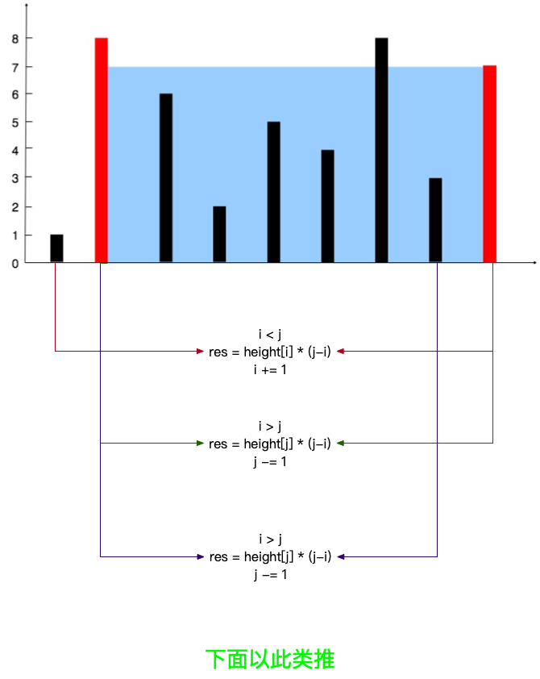

# [题目](https://leetcode-cn.com/problems/container-with-most-water/) 
```python
# 给你 n 个非负整数 a1，a2，...，an，每个数代表坐标中的一个点 (i, ai) 。在坐标内画 n 条垂直线，垂直线 i 的两个端点分别为 (i, 
# ai) 和 (i, 0)。找出其中的两条线，使得它们与 x 轴共同构成的容器可以容纳最多的水。 
# 
#  说明：你不能倾斜容器，且 n 的值至少为 2。 
# 
#  
# 
#  
# 
#  图中垂直线代表输入数组 [1,8,6,2,5,4,8,3,7]。在此情况下，容器能够容纳水（表示为蓝色部分）的最大值为 49。 
# 
#  
# 
#  示例： 
# 
#  输入：[1,8,6,2,5,4,8,3,7]
# 输出：49 
#  Related Topics 数组 双指针
```

# 思路:

1. 第一种就是暴力破解,遍历`(Python超时)`
2. 第二种:`双指针`,头尾各一个指针,比较两个指针对应位置的高度
3. 面积`res = height[low] * (j-i)`
4. 高度低的指针移动,直到两个指针相遇

# 图解:


# 代码实现:
```python
# leetcode submit region begin(Prohibit modification and deletion)
class Solution(object):
    def maxArea(self, height):
        """
        :type height: List[int]
        :rtype: int
        """
        # # 第一种方法
        # # 超出时间限制
        # max_area = 0
        # for i in range(len(height) - 1):
        #     for j in range(i + 1, len(height)):
        #         area = (j - i) * min(height[j], height[i])
        #         max_area = max(max_area, area)
        # return max_area

        # # 第二种方法往里收敛
        i, j, res = 0, len(height) - 1, 0
        while i < j:
            if height[i] < height[j]:
                res = max(res, (j - i) * height[i])
                i += 1  # 高度低往右移
            else:
                res = max(res, (j - i) * height[j])
                j -= 1  # 高度低往左移动
        return res

        # leetcode submit region end(Prohibit modification and deletion)

```
