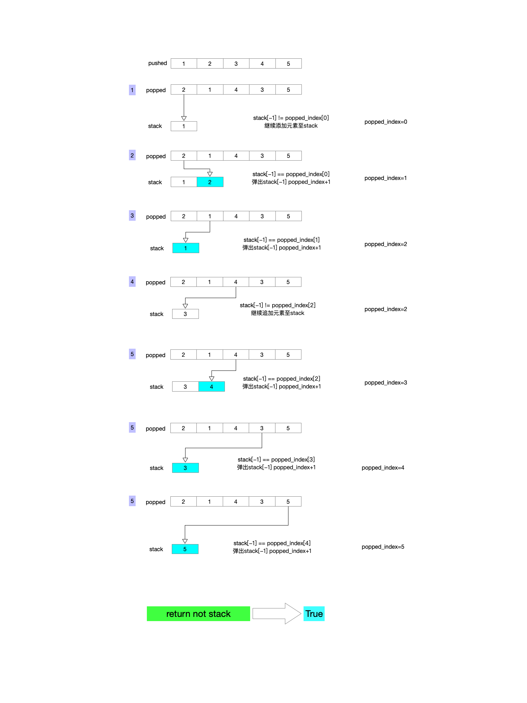

# 题目 
```python
#给定 pushed 和 popped 两个序列，每个序列中的 值都不重复，只有当它们可能是在最初空栈上进行的推入 push 和弹出 pop 操作序列的结果时，返回 true；否则，返回 false 。 

#  示例 1： 
# 
#  输入：pushed = [1,2,3,4,5], popped = [4,5,3,2,1]
# 输出：true
# 解释：我们可以按以下顺序执行：
# push(1), push(2), push(3), push(4), pop() -> 4,
# push(5), pop() -> 5, pop() -> 3, pop() -> 2, pop() -> 1
#  
# 
#  示例 2： 
# 
#  输入：pushed = [1,2,3,4,5], popped = [4,3,5,1,2]
# 输出：false
# 解释：1 不能在 2 之前弹出。
#  
# 
```

### 这道题和橙色算法第四版1.3.3习题类似
# 思路:

1. 首先想到的是把`pushed`的元素添加到一个新的栈`Stack`中
2. 根据`Stack`的栈顶即索引为`[-1]`的元素与`popped[index]`的元素比较
3. 相等则弹出,并且`index+1`
4. 不相等就继续往`Stack`中追加元素

# 图解:


# 代码实现:
```python
# leetcode submit region begin(Prohibit modification and deletion)
class Solution(object):
    def validateStackSequences(self, pushed, popped):
        """
        :type pushed: List[int]
        :type popped: List[int]
        :rtype: bool
        """
        index, stack = 0, []
        for p in pushed:
            stack.append(p)
            # 依次比较stack的最后一个元素和popped第一个元素是否相等
            # 相等就弹出 同时popped索引加一
            while stack and stack[-1] == popped[index]:
                stack.pop()
                index += 1
        return not stack

```
